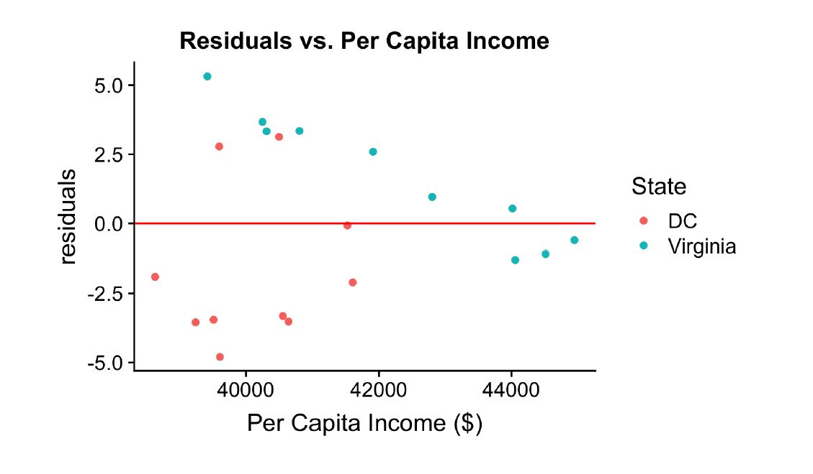
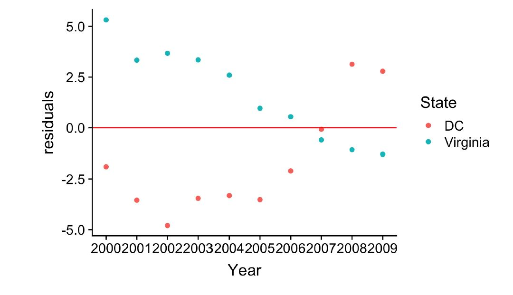

```{r setup, include=FALSE}
# R options
options(
  htmltools.dir.version = FALSE, # for blogdown
  show.signif.stars = FALSE,     # for regression output
  warm = 1
  )
# Set dpi and height for images
library(knitr)
opts_chunk$set(fig.height = 2.65, dpi = 300) 
# ggplot2 color palette with gray
color_palette <- list(gray = "#999999", 
                      salmon = "#E69F00", 
                      lightblue = "#56B4E9", 
                      green = "#009E73", 
                      yellow = "#F0E442", 
                      darkblue = "#0072B2", 
                      red = "#D55E00", 
                      purple = "#CC79A7")

options(htmltools.dir.version = FALSE)
knitr::opts_chunk$set(
	fig.align = "center",
	fig.height = 3.75,
	fig.width = 6.25,
	message = FALSE,
	warning = FALSE
)
```

```{r echo=FALSE, message=FALSE, warning=FALSE}
library(tidyverse)
library(rvest)
# library(STA210)
library(Sleuth3)
library(infer)
```

class: middle, center

### Download slides at TBD

### Download companion Rmd at TBD


---

## Agenda

- What is regression?
- Prepping your data
- Fitting a model
- Model Diagnostics
- Checking Assumptions
- Q&A 

---


## Disclaimer

- Regression is a complicated and deep subject. While this talk is a solid introduction, there are some significant caveats to its use. There is a whole undergraduate course at Duke on regression (STA 210). As such, it's probably not a good idea to publish a paper based on what a statistics grad student taught you in an hour.
- These slides make significant use of the course material from STA 210, taught by Professor Maria Tackett
  - You can access course materials [here](http://bit.ly/sta210-fa19) - they provide significantly more detail than is available here

---


## Simple Linear Regression

- We observe a dataset $\mathbf{Y}$ composed of $n$ observations, $Y_1...Y_n$, and an explanatory variable $X_1...X_n$ 
- Suspect that there is an (imperfect) linear relationship between $\mathbf{Y}$ and $\mathbf{X}$, thus our model is $Y_i = \beta_0 + \beta_1x_{i1} +  \epsilon$
 - $\epsilon$ is an error term - we assume that it's drawn from a normal (bell-curve) distribution with an unknown variance $\sigma^2$
- We don't know what $\beta_0, \beta_1$, or $\sigma^2$ are - but we'd like to estimate them
  - We'll call our estimate for the unknown $\beta$ and $\sigma^2$ as $\hat{\beta}$ and $\hat{\sigma^2}$ respectively


---


## Expanding To Multiple Predictors

- Dataset of $n$ observations of a response variable $\mathbf{Y}$, believed to be driven by $p$ explanatory variables $\mathbf{X}$ plus an intercept
- Each $Y_i = \beta_0 + \beta_1x_{i1} + \beta_2 x_{i2} + \dots + \beta_p x_{ip} + \epsilon$
- We can write this in matrix notation as $\mathbf{Y = X\beta}  + \epsilon$
- This allows us to estimate the individual impact that changes to a specific variable will have on future observations while controlling for the impact of other (correlated) variables

---


### Ordinary Least Squares (OLS) Regression

- Collectively, the standard technique for regression with one or more is called ordinary least squares (OLS)
- OLS finds the vector (straight line) that minimizes the squared vertical distance between the line and each of the data points
-- We refer to this squared distance as the <font class="vocab">**sum of squared error**</font>. We want to minimize it. 
```{r,echo=F}
library("readr")
wages <- case1202 %>% 
  mutate(Sex = as.factor(Sex), Education = case_when(
    Educ < 12 ~ 'HighSchool',
    Educ == 12 ~ 'Bachelor',
    TRUE ~ 'Graduate')) %>%
  select(-Sal77, -Educ)

```

```{r echo=F, warning=FALSE, message=FALSE, fig.height=2.5}


m <- lm(Bsal ~ Exper,data=wages)
ggplot(data=wages,mapping=aes(x=Exper,y=Bsal)) + 
  geom_point() + 
  geom_smooth(method="lm",se=FALSE) + 
  geom_segment(aes(x=Exper, xend=Exper, y=Bsal, yend=predict(m),color="red", show.legend = FALSE)) +
  labs(title="Example: Wages Against Experience", x="Months of Experience", y="Monthly Salary") + 
  theme(legend.position = "none")
```

---

## Categorical Data

- Frequently, somes variables are discrete categories (gender, race, education level, etc)
- R will assume you'd like to regress an explanatory variable categorically if the column is stored as a `factor`, and generate the categories automatically for you
- We can capture this using linear regression by adding $k-1$ binary (taking values 1 or 0) variables into our model for a variable with $k$ different levels
  - We only need $k-1$ variables because once you've observed the first $k-1$ variables, you know what the value of the last variable is
  - Example: if you'd like to encode (alive vs. dead) as a variable, it's sufficient to use a variable that's $1$ if the observation is alive, $0$ if the observation is not alive.  
- Do NOT include as many variables as you have categories - this will cause an issue called multicollinearity 


---
## Example: Wage Data
- In the 1970s Harris Trust and Savings Bank was sued for discrimination on the basis of gender.
- The following dataset is a collection of wages for bank employees

#### Variables
**Explanatory**
- <font class="vocab">`Educ`: </font>Education, either 'HighSchool', 'Bachelors', or 'Graduate'
- <font class="vocab">`Exper`: </font>months of previous work experience (before hire at bank)
- <font class="vocab">`Sex`: </font>"Male" or "Female"
- <font class="vocab">`Senior`: </font>months worked at bank since hire
- <font class="vocab">`Age`: </font>age in months

**Response**
- <font class="vocab">`Bsal`: </font>annual salary at time of hire

---

## Glimpse of data

```{r}
glimpse(wages)
```
---

## Fitting a model

- R allows you to use formula objects to interact with your data using column names
- Can also use `response ~ .` to regress a column named `response` against everything else in the data frame

```{r}

model <- lm(Bsal ~ Education + Exper + Sex + Senior + Age, data=wages)
broom::tidy(model) %>% kable(format="markdown", digits=3) # View the output
```
- Note that R has automatically converted the 'Sex' and 'Education' variables to a categorical variable and added categories as necessary
  - The 'missing' category is captured by the intercept

---
## Interpreting the output

- **estimate**: the estimated value of the $\beta$ coefficient for that explanatory variable.
  - For most coefficients, the way to interpret this is "*for every 1 unit increase in X, we observe a $\beta$ unit increase in $Y$.*"
  - For the **intercept**: the interpretation is "*the expected (average) value for $Y$ if all the $X$ variables are $0$*"
- **std.error**: The standard error estimate for the coefficient
- **statistic**: The t-statistic for deviation 
- **p.value**: The p-value implied by the t-statistic
  - The interpretation of the p-value for a particular coefficient $\hat{\beta_j}$ is "the probability of calculating a $\hat{\beta_j}$ this extreme or more extreme **assuming the null hypothesis is true** (in this case, null hypothesis is $\beta_j=0$)
  - p.value appears to be $0$ in table above because we've truncated to 3 digits, it's actually just very small

---

## Prediction

```{r}
x_star <- data.frame(Senior=96, Age=329, Education='HighSchool', Exper=14.0, Sex="Male")
predict(model, x_star, interval='prediction', level=0.95)
```

- Code above shows how to obtain an estimate ('fit') as well as the lower and upper bounds of the 95% prediction interval
- Types of uncertainty estimates for predictions:
  - **Confidence interval** (interval='confidence') captures the uncertainty inherent in estimating $\beta$ - this is our best guess for the average value of $Y$ at $X$ 
  - **Prediction interval** (interval='prediction') captures the uncertainty in obtaining $\hat{\beta}$, **plus** the uncertainty from the error inherent in $Y$
  - Prediction intervals are always guaranteed to be wider as a result

---
## Try it out

Download the .Rmd from ASDF and 


---

## Checking Assumptions of Linear Regression

- OLS only gives unbiased estimates if four assumptions are satisfied
  - **Linearity**: $Y$ cannont depend on $\mathbf{X}$ in a nonlinear way - 
  - **Normality**: The error must be normally distributed, and centered at $0$. Note: $\mathbf{X}$ can be distributed however you want - it's **just the error $\epsilon$**  that needs to be normally distributed
  - **Constant Error** The amount of error can't change as the predicted value changes
  - **Independence**: Each individual $Y_i$ can't depend on any of the other $Y_i$'s except via their individual $X$ values
- If these assumptions don't hold, the estimates $\hat{\beta}, \hat{\sigma}^2$ (and the p-values) are not guaranteed to be accurate


---

### Assumption 1: Linearity
- **How to check**: Plot the predicted value $\hat{Y}$ against residuals
  - Values should be centered around $0$ at every value of $\hat{Y}$
- When conducting multiple linear regression, it's advisable to check the relationship for each individual predictor, as well as $\hat{Y}$ overall. 
- You can fix this by transforming $Y$ or $X$ to make the relationship linear - but remember then that your predictors, confidence intervals, etc, are all going to be in the transformed space, and won't necessarily translate back to the same point in the untransformed space

---
### Linearity continued
```{r, echo=F, message=F, warning=F}
library(fivethirtyeight) #fandango dataset
movie_scores <- fandango %>%
  rename(critics = rottentomatoes, 
       audience = rottentomatoes_user) %>% mutate(critics_sq = log(critics), audience_non_normal = audience -20 + 40*rbernoulli(n=nrow(fandango)))
model <- lm(audience ~ critics + year, data = movie_scores)
model_nonlinear <- lm(audience ~ critics_sq + year,data= movie_scores)
model_non_normal <- lm(audience_non_normal ~ critics + year,data= movie_scores)
movie_scores <- movie_scores %>% mutate(residuals=resid(model), yhat=predict(model), 
                                        residuals_nonlinear=resid(model_nonlinear), yhat_nonlinear=predict(model_nonlinear),
                                        residuals_non_normal = resid(model_non_normal), yhat_non_normal=predict(model_non_normal),)
```
```{r, echo=F, message=F, warning=F}
library(egg)
p1 <- ggplot(data=movie_scores,mapping=aes(x=yhat, y=residuals)) + 
  geom_point() + 
  geom_hline(yintercept=0,color="red")+
  labs(title="Residuals without Nonlinearities (Good)")

p2 <- ggplot(data=movie_scores,mapping=aes(x=yhat_nonlinear, y=residuals_nonlinear)) + 
  geom_point() + 
  geom_hline(yintercept=0,color="red")+
  labs(title="Residuals with Nonlinearity (Bad)")

grid.arrange(p1, p2, nrow=2)
```
- DON'T worry if the data is bunched in some areas left-to-right
- DO worry if the data appears to be bunched above/below the line
  

---

### Assumption 2: Normality

- $\epsilon$ must be distributed **normally** - i.e. from a bell curve
- **How to check**: Make a histogram and QQ-plot of the residuals, and examine if the data appears to be normally distributed
  - You should observe a roughly bell-shaped curve. Anything else indicates that the normality assumption is violated

- DON'T worry if the histogram shows a somewhat spikey pattern - this happens a lot just due to inherent randomness if your sample size is small
- DO worry if you see multiple modes emerge in the histogram - an 'M' shape is almost certainly evidence of a problem

---

### Assumption 2: Normality (cont'd)


```{r, warning=F, message=F}
p1 <- ggplot(data=movie_scores,mapping=aes(x=residuals)) + 
  geom_histogram() + 
  labs(title="Histogram, Normal Error")
p2 <- ggplot(data=movie_scores,mapping=aes(sample=residuals)) + 
  stat_qq() + stat_qq_line() +  
  labs(title="QQ-Plot, Normal Error")
p3 <- ggplot(data=movie_scores,mapping=aes(x=residuals_non_normal)) + 
  geom_histogram() + 
  labs(title="Histogram, Non-Normal Error")
p4 <- ggplot(data=movie_scores,mapping=aes(sample=residuals_non_normal)) + 
  stat_qq() + stat_qq_line() +  
  labs(title="QQ-Plot, Non-Normal Error")
grid.arrange(p1, p2, p3, p4, nrow=2, ncol=2)
```

---

## Assumption 3: Constant Error

- The typical error $\sigma^2$ can't change as $X$ changes
- **How to check**: Plot the predicted value $\hat{Y}$ against residuals. The spread above/below zero shouldn't change. 

```{r, echo=FALSE,out.width = '80%',fig.align='center'}
knitr::include_graphics("intro_regression_slides_files/regression.png")
```


```{r, echo=FALSE,out.width = '80%',fig.align='center'}
#- Occurs frequently with time series data - below is an example, where Netflix's stock has different volatility at different times
library(tidyquant)
netflix <- tq_get("NFLX", from='2009-01-01', to='2020-01-01', get='stock.prices')
# netflix %>% ggplot(aes(x=date,y=adjusted)) + geom_line() + labs("NFLX Stock Price", y="Price, USD", x="Date") 

```


---

### Assumption 3: Constant Error

```{r, echo=F, message=F, warning=F}
p1 <- ggplot(data=movie_scores,mapping=aes(x=yhat, y=residuals)) + 
  geom_point() + 
  geom_hline(yintercept=0,color="red")+
  labs(title="Residuals without Nonconstant Error (Good)", x="Predicted Value", y="Residual")

p2 <- ggplot(data=movie_scores,mapping=aes(x=yhat, y=residuals*yhat^2)) + 
  geom_point() + 
  geom_hline(yintercept=0,color="red")+
  labs(title="Residuals with Nonconstant Error (Bad)", x="Predicted Value", y="Residual")

grid.arrange(p1, p2, nrow=2)
```
- Note how the bottom plot has noticeably higher error as the predicted value increases

---

## Assumption 4: Independence

- Each $Y_i$ can't depend in some way on any other $Y_j$, beyond what's captured in $X$
- Common issues with this assumption are:
  - **Serial effect**: If data are collected over time, there is a chance of autocorrelation in the dataset
  - **Cluster effect**: If $Y$ depends on some variable that's not included in your model

---

### Example Residuals: Cluster Effect 


```{r, eval=F}
ggplot(data=pew_data, mapping = aes(x=percapitaincome,y=residuals,color=State)) + 
  geom_point() + 
  geom_hline(yintercept=0,color="red") +
  labs(title="Residuals vs. Per Capita Income", 
       x="Per Capita Income ($)")
```
```{r, echo=FALSE, out.width='100%', fig.align='left'}

```

---
 
### Example Residuals: Serial Effect
```{r, eval=F}
ggplot(data=pew_data, aes(x=Year,y=residuals,color=State)) + geom_point() +
  geom_hline(yintercept=0,color="red")+
  labs("Residuals vs. Year") + 
  scale_x_continuous(breaks=seq(2000,2009,1))
```

```{r, echo=FALSE, out.width = '100%',fig.align='left'}

```

---

---

### Common Scenarios That Violate Assumptions

- **I'm predicting one or more time series**: Most time series suffer from some amount of *autocorrelation*, which violates the independence assumption. A common fix is to calculate the growth rate between each time step, and run your regression on that, though this isn't guaranteed to 
- **I'm predicting an index value, like app ratings**: Because indexes are typically bounded, the normality assumption breaks down as we get closer to our bounds. Try dividing your data into , and using *multinomial regression*
- **I'm predicting the number of times something happens**: Similarly, as $Y$ approaches $0$, the assumption of normality breaks down . This isn't a huge problem if your observations aren't close to zero. Otherwise, consider Poisson regression for a more appropriate model. 
- **I'm predicting a binary variable, with a yes/no reponse**: This will violate the normality assumption - use *logistic regression* instead

---

## Cautions
- Avoid extrapolation:
  - Relationships can change at different portions of the data
  - Almost all continuous functions are locally linear - but a nonlinear trend might emerge as you extend beyond the scope of your data
- Regression shows only correlation, not causation
  - Proving causality requires a carefully designed experiment or carefully accounting for confounding variables in an observational study
- Be careful of providing variables that are too correlated 
  - You can use model selection techniques to help understand which variables you should retain


---

### Important Topics We Didn't Cover:

- **Interaction terms**: What to do when some of your variables might produce an additional response when viewed together
- **Model selection**: How to know which variables to include in your model
- **Outlier detection**: Use of Cook's Distance and other techniques for detecting outliers
- **Logistic Regression**: When your observed variable is a binary (yes/no) response
- **Multinomial Regression**: Similar to logistic regression, when your response is one or more discrete categories
- **Penalized regression**: Wide class of techniques used to obtain more stable estimates of $\beta$ at the expense of an unbiased estimate
- **Poisson regression**: Used to model count-based data
- **Bayesian approaches to regression**: How to use priors to gain estimates of the distribution of $\hat{\beta}, \hat{\sigma^2}$